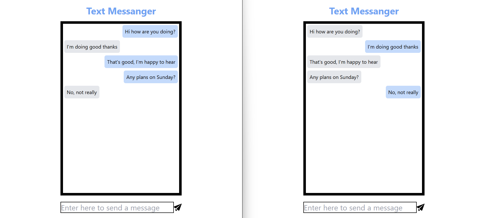

# Realtime Messanger

## Overview 🧭

A basic text messaging app.

<p align="center">
  
</p>

## Features 🔧

- **Simplistic Frontend Design**: Easy to use with a simple chatlog and the ability to send messages
- **Realtime Messaging**: Utilizes websockets to send and receive messages in realtime

## Usage 🛠️

### <ins>Setup and Shutdown</ins>

You can run the setup.sh script to get the webapp quickly running. Note the backend runs on port 8080 and the two frontend instances run on port 3000 and 3001 respectively.

```bash
bash setup.sh
```

As this runs in the background, you can use the shutdown.sh script to shutdown the proceses on these ports

```bash
bash shutdown.sh
```

## License 📄

This project is licensed under the MIT License - see the [LICENSE](LICENSE) file for details.
